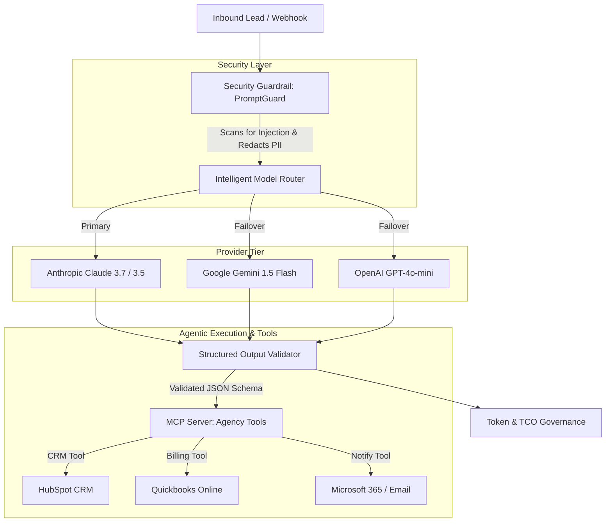

# 🚀 Agency AI Integrator Suite

[](https://www.python.org/)
[](https://modelcontextprotocol.io/)
[](#security--guardrails)
[](LICENSE)

An enterprise-ready, production-grade **AI Integration & Automation Suite** designed for digital agencies, SMB solutions, and AI integrators. 

This repository demonstrates **Model Context Protocol (MCP)** server architecture, multi-provider intelligent LLM routing, security guardrails, cost & token governance, and client discovery frameworks.

---

## 🌟 Key Pillars & Features

| Module | Location | Key Capabilities |
| :--- | :--- | :--- |
| **Model Context Protocol (MCP)** | [`mcp_server/`](mcp_server/) | FastMCP server exposing tools for CRM lead queries, campaign analytics, and automated action audit logging. |
| **Intelligent Multi-Model Router** | [`workflows/model_router.py`](workflows/model_router.py) | API-first fallback engine across **Anthropic Claude**, **Google Gemini**, and **OpenAI** with automatic failover and latency tracking. |
| **Security Guardrails** | [`security/`](security/) | Prompt injection detection, PII redaction (SSN, Credit Cards), and strict Pydantic output schema validation. |
| **Cost & Token Governance** | [`governance/`](governance/) | Real-time request token pricing, per-client API spend calculator, and 30-day TCO budget projection engine. |
| **Unified Demonstration CLI** | [`app.py`](app.py) | Interactive runner executing demonstrations across all 4 suite pillars. |
| **Client Discovery & Scope** | [`docs/`](docs/) | Consultative discovery call blueprint, solution architecture diagrams, and proposal templates for SMB clients. |

---

## 🏗️ System Architecture



---

## ⚡ Quickstart & Local Setup

### 1. Clone & Install Dependencies
```bash
git clone https://github.com/amandahervol-alt/agency-ai-integrator-suite.git
cd agency-ai-integrator-suite
pip install -r requirements.txt
```

### 2. (Optional) Configure Live API Keys
Copy `.env.example` to `.env` to enable live model inference:
```env
ANTHROPIC_API_KEY=sk-ant-your-key-here
ANTHROPIC_MODEL=claude-3-7-sonnet-20250219
```
*(If no API key is provided, the suite executes in zero-config offline simulation mode).*

### 3. Run the Unified Suite CLI
```bash
# Run all 4 pillars end-to-end
python app.py

# Or run a specific pillar:
python app.py --pillar mcp
python app.py --pillar security
python app.py --pillar agent
python app.py --pillar governance
```

### 4. Run Automated Test Suite
```bash
python -m unittest discover tests
```

---

## 🔒 Security & Data Compliance

- **Prompt Injection Filter**: Blocks pattern vectors such as `ignore previous instructions`, `system prompt override`, and malicious script tags.
- **PII Scrubbing**: Automatically replaces SSNs and credit card numbers with `[REDACTED_SSN]` and `[REDACTED_CREDIT_CARD]` before forwarding payloads to external LLM providers.
- **Output Schema Enforcer**: Ensures zero downstream failures in Quickbooks/HubSpot integrations by enforcing strict JSON validation.

---

## 📄 License

This project is licensed under the [MIT License](LICENSE).
