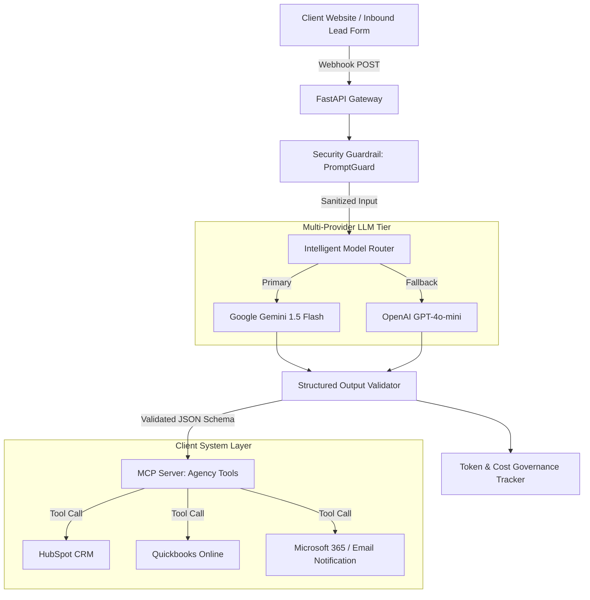

# Sample Solution Architecture & Technical Proposal

> **Project Name**: Automated AI Lead Engagement & Accounting Pipeline  
> **Prepared For**: Sample SMB Client  
> **Prepared By**: EZMarketing AI Engineering Team  

---

## 1. Executive Summary

This proposed architecture automates client intake, lead enrichment, and CRM sync using an event-driven AI workflow powered by Model Context Protocol (MCP) and secure multi-model routing (Google Gemini + OpenAI fallback). 

---

## 2. Technical System Architecture

---

## 3. Security & Governance Standards

- **Prompt Injection Defense**: Every user input passes through regex and semantic vulnerability scanners before entering prompt context.
- **PII Redaction**: Sensitive fields (SSN, payment info) are scrubbed automatically at the edge.
- **Output Schema Enforcer**: Strict Pydantic parsing prevents malformed LLM responses from causing database runtime errors.
- **Cost Cap**: Monthly token consumption is monitored; automatic rate-limiting triggers if budget thresholds (e.g. $150/mo) are reached.

---

## 4. Implementation Timeline (3 Weeks)

| Phase | Milestone | Duration |
| :--- | :--- | :--- |
| **Phase 1** | API Connection & MCP Tool Configuration | Week 1 |
| **Phase 2** | AI Agent Prompt Tuning & Security Guardrail Setup | Week 2 |
| **Phase 3** | End-to-End Testing, CRM Sync & Client Training | Week 3 |
